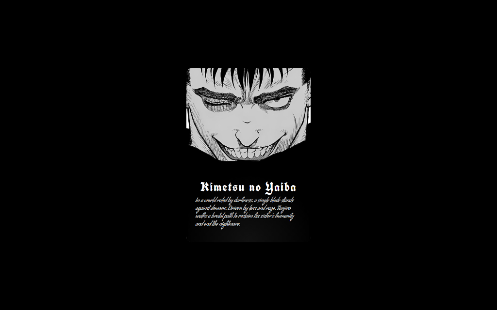
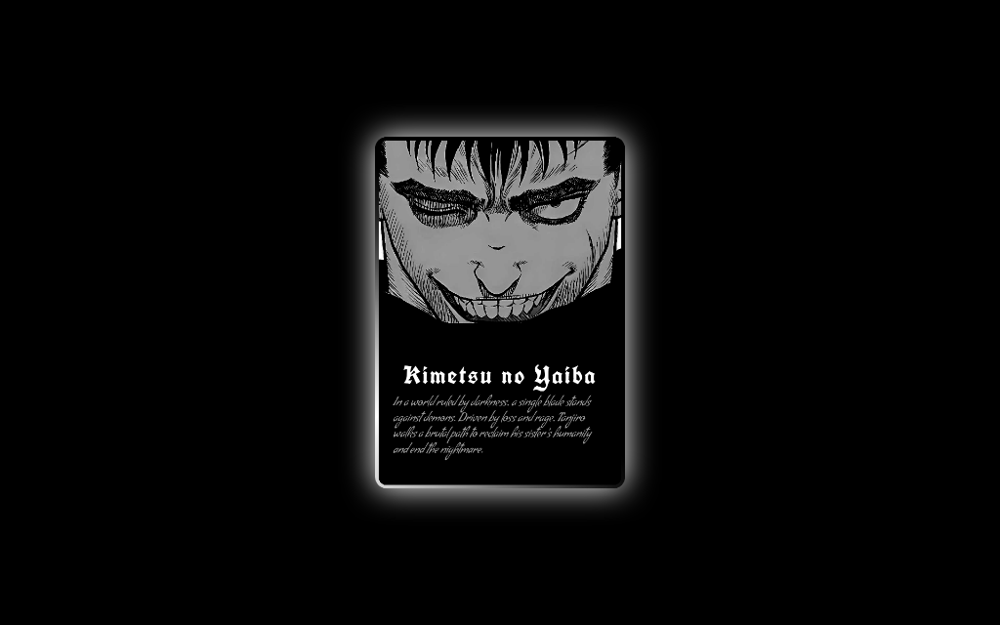

# Advanced CSS Practice: Berserk Animated Card

A frontend experiment exploring modern CSS capabilities like **Houdini API (`@property`)**, **Conic Gradients**, and **Hardware Acceleration**. Built to master complex animations and performant UI effects without JavaScript.

The project features **Guts**, the Black Swordsman from _Berserk_, framed by a rotating, glowing aura implemented entirely with modern CSS.

## 📸 Preview




## ✨ Features

- **Advanced CSS Animations**: Utilizes custom properties (`@property`) for smooth variable interpolation.
- **Glowing Rotating Border**: Implemented using `conic-gradient` and CSS keyframes.
- **Interactive Hover Effects**: Dynamic shadows and border expansion on mouse interaction.
- **Responsive & Optimized**: Built with performance in mind using `will-change` properties.
- **Pure CSS**: No JavaScript logic required for the visual effects.

## 🛠️ Tech Stack

- **HTML5**: Semantic structure.
- **CSS3** (Modern Features):
  - CSS Variables (Custom Properties)
  - CSS `@property` API
  - Conic Gradients
  - Flexbox Layout

## 🚀 How to Run

1. **Clone the repository:**
   ```bash
   git clone https://github.com/codebysrk/glow-card.git
   ```
2. **Navigate to the project directory:**
   ```bash
   cd glow-card
   ```
3. **Open `index.html`** in your favorite browser to see the magic!

---

**"He who fights with monsters might take care lest he thereby become a monster."**
